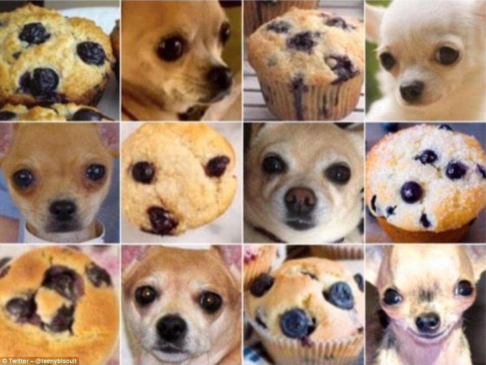

# Negminer: A hard negative mining tool

[](https://opensource.org/licenses/Apache-2.0)

[](https://communityinviter.com/apps/nixiesearch/nixiesearch)

A tool to simplify hard negative mining process for training embeddings models:

* Embeds documents and queries, builds ANN index, retrieves top-N candidates and scores them with a cross-encoder model.
* Supports multi-GPU inference: [complete MSMARCO with 8M documents](configs/msmarco.yml) embedded in 10 minutes on 2x RTX4090
* Uses [FAISS](https://github.com/facebookresearch/faiss) HNSW index for ANN candidate retrieval
* Can run any [sentence-transformers](https://sbert.net/) compatible embedding and cross-encoder model.

## What are hard negatives?

Hard negatives are search results which are close semantically to your query, but not being relevant.



Embedding models are being trained with a [contrastive approach](https://lilianweng.github.io/posts/2021-05-31-contrastive/) when you need to show the difference between relevant and irrelevant document to the model. A simple way of getting negatives is to use random sampling: any random document is a negative! But this approach makes the life of the underlying ML model too simple, as it's too easy to distinguish `ketchup` from `tractor` for a `tomato` query. 

Harder negatives make the model training much harder: it need to pick minor differences between semantics of documents to figure out what is relevant and what's not - like on a picture with Chihuahuas and muffins above. Negminer automates the job of building such hard negatives.

## Install

Negminer is not yet on PyPi, so install it from GIT:

```bash
git clone https://github.com/nixiesearch/negminer
cd negminer

python -m venv .venv
source .venv/bin/activate

pip install -e .
```

## Usage

The mining process has multiple steps:

* Create a config file.
* Preprocess and tokenize the dataset for embedding.
* Embed documents and queries
* Perform ANN search to retrieve candidates
* Preprocess the mined query-document pairs dataset for CE scoring
* Score candidates with a Cross-Encoder model
* Export negatives

### Config file

A YAML file with the following syntax:

```yml
corpus: data/mteb/msmarco/corpus.jsonl
queries: data/mteb/msmarco/queries.jsonl
qrels: data/mteb/msmarco/qrels/train.tsv
embedding: intfloat/e5-base-v2 # sentence-transformers compatible model
doc_prompt: "passage: " # E5 model requires custom prompt
query_prompt: "query: "
embedding_seq_len: 512 # trim everything longer
embedding_batch_size: 1024 # depends on your GPU, start with lower number like 32
ce: BAAI/bge-reranker-v2-m3 # CE model
ce_seq_len: 512 # different max sequence length for a CE model as it might be bigger
out_dir: out/msmarco # work dir
```

### Preprocessing data

During preprocessing, Negminer reformats the data in an [Apache Arrow](https://arrow.apache.org/) tables with the [HF datasets](https://huggingface.co/docs/datasets/en/index), so on later stages data can be directly streamed into the GPU. To run preprocessing, run the `negminer.preprocess` job:

```bash
python -m negminer.embed.prepare <path-to-config.yml>
```

In your `out_dir` directory you will see a `corpus`, `queries` and `qrels` datasets.

### Embedding documents

For large embedding models, the embedding process can take some time and you may want to run it only once and cache the results - that's why it is a separate step. For single-GPU setups, you can run it directly with Python:

```bash
python -m negminer.embed <path-to-config.yml>
```

For multi-GPU setup, run the embedder with the [Accelerate](https://huggingface.co/docs/accelerate/index):

```bash
accelerate launch -m negminer.embed <path-to-config.yml>
```

After the emedding process is done, a `corpus_embed` and `queries_embed` datasets will appear in the `out_dir` directory.

### Retrieving candidates

After documents and queries are embedded, you can build the ANN index with the [FAISS](https://github.com/facebookresearch/faiss) library:

```bash
python -m negminer.search <path-to-config.yml>
```

After the process is done, the `qrels_mined` dataset will appear in the `out_dir`.

### Tokenize mined query-document pairs

As embedding and cross-encoder model might use different tokenizers, we need to reprocess the dataset again, tokenizing all the mined query-document pairs:

```bash
python -m negminer.score.prepare <path-to-config.yml>
```

On this step for all query-document pairs, we will tokenize each, and save them into a `out_dir/ce_tokenized` dir.

### Scoring with cross-encoders

On the last step you need to run the CE scoring process:

```bash
accelerate launch -m negminer.score <path-to-config.yml>
```

It might take some time: MSMARCO train split with 16 negatives each takes ~1h on 2x 4090 to be scored. At the end of the process, you'll get a `out_dir/qrels_scored` dataset.

### Exporting negatives

TODO

## Data format 

Negminer supports [TREC input](https://stackoverflow.com/questions/10480022/what-is-the-trec-format) format in the [BEIR](https://github.com/beir-cellar/beir) flavor:

* a set of `corpus.json`, `queries.json` and `qrels.tsv` files.
* `corpus.json` file contains your document corpus with `_id`, `text` and optional `title` fields.
* `queries.json` file contains all your query text with `_id` and `text` fields.
* `qrels.tsv` TSV file has triplets of `query-id`, `corpus-id` and `score` columns, where `score` is an integer relevance label.

Check out this [HotpotQA](https://huggingface.co/datasets/mteb/hotpotqa) repo as an example of a well-formatted dataset.

## Output format

Negminer outputs a JSONL format with the following fields:

```json
{
    "query": "query-id",
    "docs": ["doc1", "doc2", "doc3"],
    "doc_scores": [1.0, 0.0, 0.0],
    "query_doc_cos": [0.95, 0.50, 0.10],
    "query_doc_ce": [0.84, 0.75, 0.20],
    "doc_doc_cos": [1.0, 0.1, 0.3, 0.2, 1.0, 0.3, 0.3, 0.2, 1.0]
}
```

Fields are:

* `query`: a query identifier from the `queries.json` TREC source dataset
* `docs`: a list of document ids from the `corpus.json` TREC source dataset. This list includes both positives from qrel, and mined negatives. You can distinguish between them by the `doc_scores` field, where positives will have non-zero score.
* `doc_scores`: a set of explicit scores taken from the `qrel.tsv`. All mined negatives will have score of 0.0. All documents referenced in the qrels are going to be included, both positives and negatives.
* `query_doc_cos`: cosine similarity between query and all documents in the `docs` field.
* `query_doc_ce`: Cross-encoder similarity score between query and all documents in the `docs` field.
* `doc_doc_cos`: a document-document cosine similarity. A square matrix of size `len(docs) * len(docs)` with all documents are compared to themselves. Useful for duplicate and semi-duplicate detection.

## License

[Apache License 2.0](LICENSE.md)